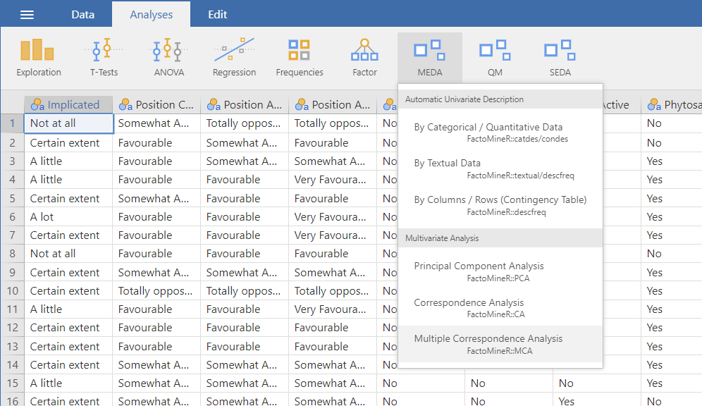

The second method of the **Free perception** submenu is AND method. The data used here is the gmo data set provided with the SEDA module.
```{r MCA1, out.width="60%", fig.align="left", echo=FALSE}
#
```
<br><br />

## **The interface**


<br><br />

### Variables selection
```{r PCA2, out.width="50%", fig.align="left", echo=FALSE}
#knitr::include_graphics("images/PCA2.png")
```
<br><br />

...
<br><br />


## **Potential issue(s)**

### Incorrect number of factors

For the AND to run correctly, the...

## **Example**

The data set used for this demonstration is the...
```{r PCA5, out.width="40%", fig.align="left", echo=FALSE}
#knitr::include_graphics(c("images/PCA5.png","images/PCA13.png","images/PCA14.png"))
```
<br><br />

...
<br><br />