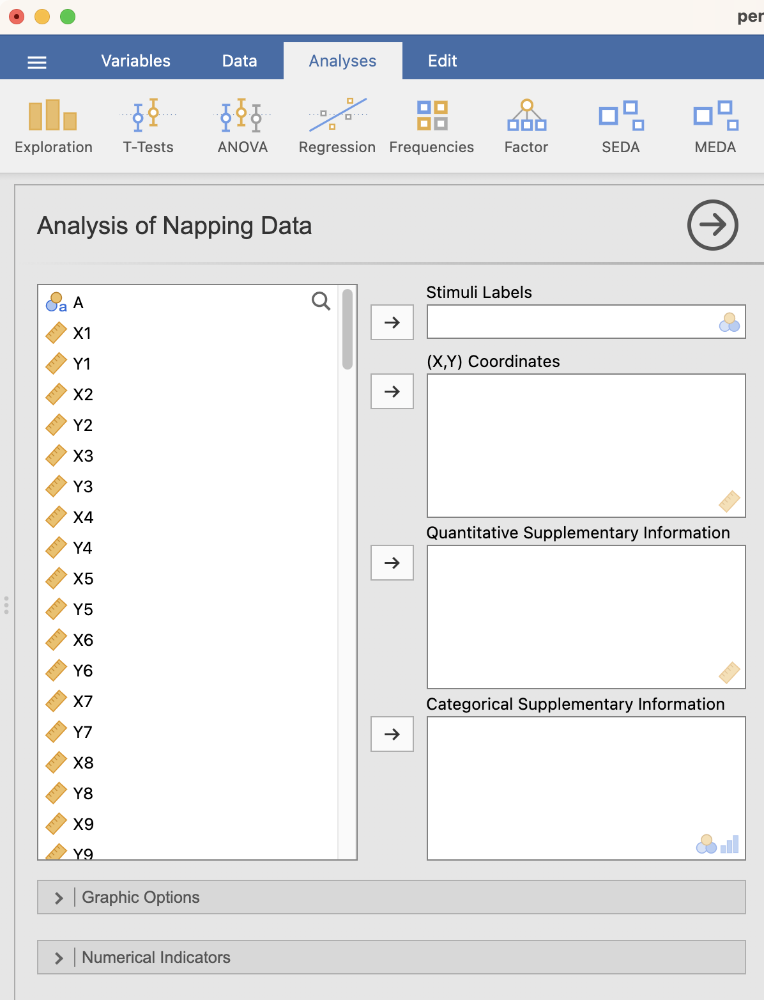

For the analysis of Napping Data, a particular case of MFA has been interfaced. To illustrate the method we will work on the *perfumes_napping* dataset.

## **The interface**

As shown in the figure below, the interface is very simple and has only 2 fields you really need to worry about: the labels and the coordinates. Supplementary information are really interesting to add, but they are also optional: the analysis can be run without them. To run the an

```{r nap1, out.width="65%", fig.align="left", echo=FALSE}

```


## **Example**

To illustrate the function we use the *perfumes_napping* dataset, where 12 perfumes were evaluated by 60 consumers.

```{r nap2, out.width="65%", fig.align="left", echo=FALSE}
knitr::include_graphics("images/nap2.png")
```


<br><br />
