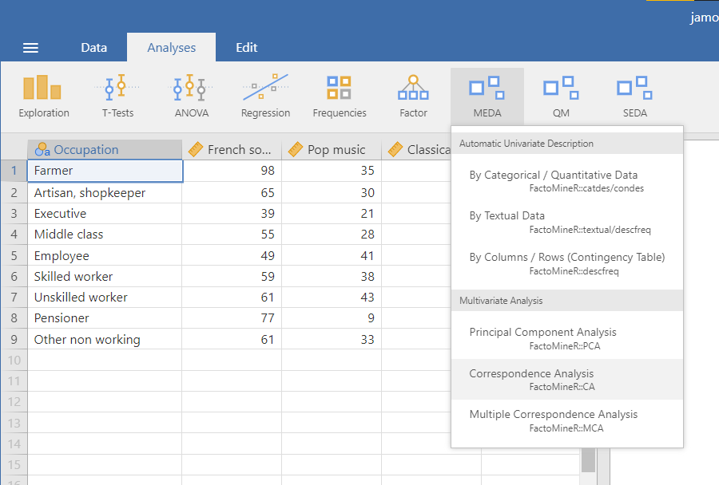
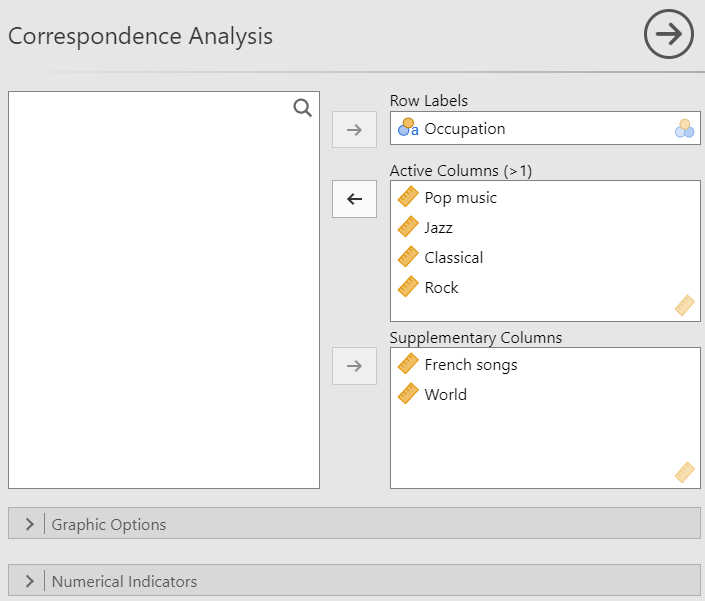
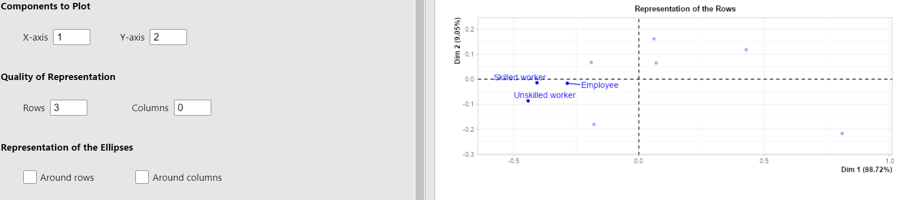
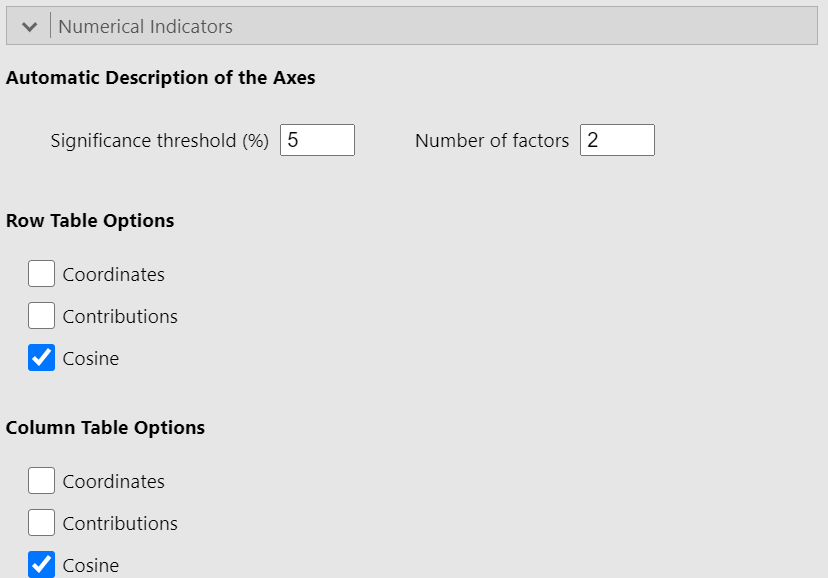
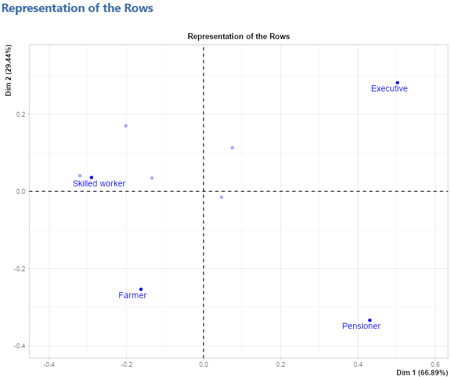
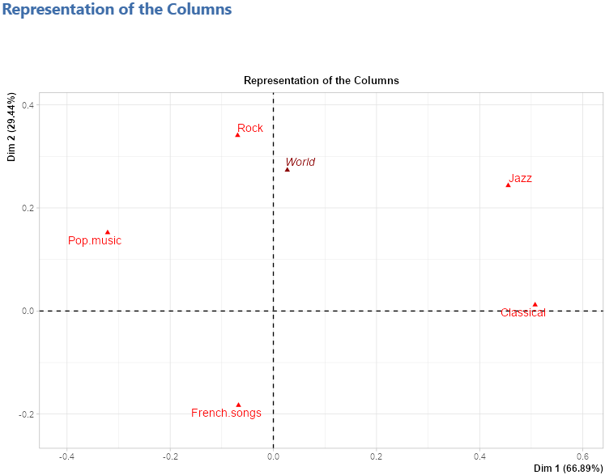
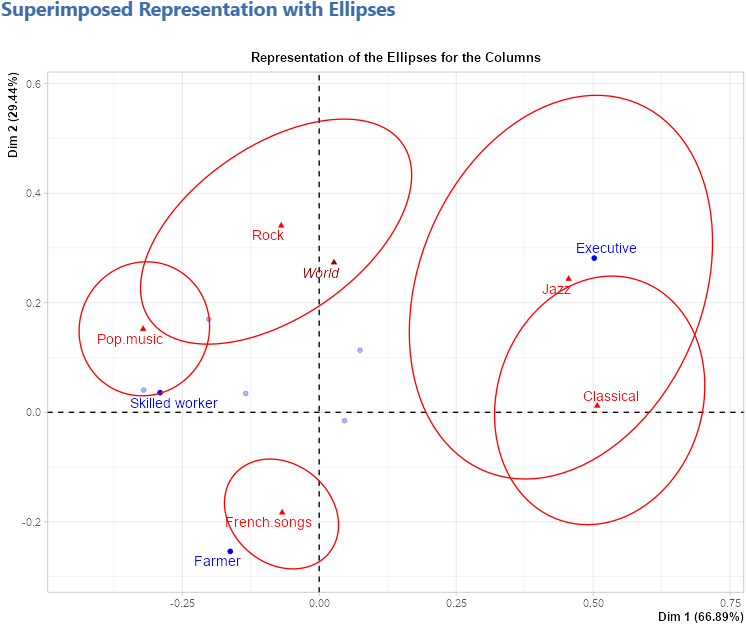
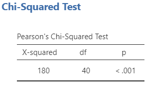
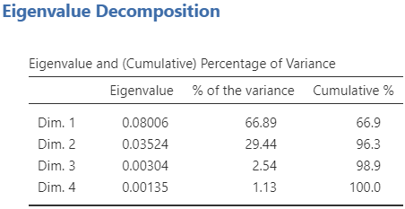
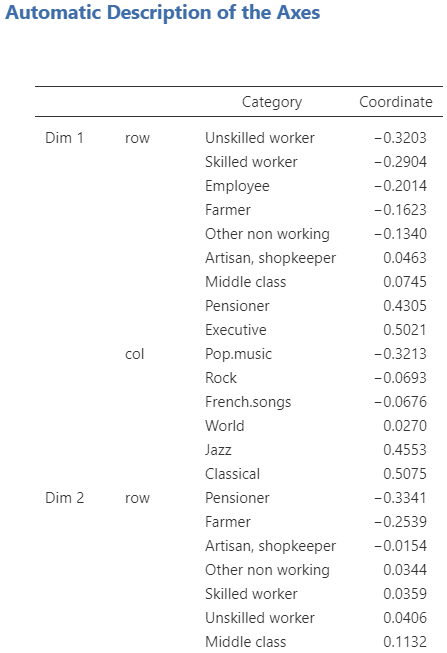

The second analysis available in the **Multivariate Analysis** submenu is the correspondence analysis.\
Since a CA is used on a contingency table, the data used for this analysis in jamovi must contain a column with the row labels and the rest of the columns must only take positive integers as value (e.g. frequency in a contingency table). You can see an example in the figure below.
```{r CA1, out.width="60%", fig.align="left", echo=FALSE}

```
<br><br />


## **The interface**

The CA interface in it's structure is very similar to the PCA interface. From top to bottom, there are the variable suppliers, the graphic options and the numerical indicators.
<br><br />

### Variables selection

```{r CA2, out.width="60%", fig.align="left", echo=FALSE}

```

Similarly to the PCA, the first part of the interface is selecting the variables and giving them a role. For the CA, you have to specify the variable used as the row labels as well as the active columns. it's also possible to add supplementary columns.
<br><br />

### Graphic options

```{r CA3, out.width="60%", fig.align="left", echo=FALSE}
knitr::include_graphics("images/CA3.png")
```
<br><br />

The __*Components to Plot*__ options are used to select the dimensions to be plotted on the x-axis and y-axis. The __*Quality of Representation*__ options allow you to choose which rows (or columns) to highlight in the plot representing the rows (or columns). For instance, if we set 3 in the *Rows* text box, the 3 rows which are the best represented on both the x-axis and y-axis (the criterion used is the sum of the cosine on both of those axes), will be highlighted (see the figure below).

```{r CA4, out.width="80%", fig.align="left", echo=FALSE}

```
<br><br />

Lastly, the __*Representation of the Ellipses*__ options allow you to display confidence ellipses around either or both rows and columns. Here is an example when checking the *Around columns* checkbox.

```{r CA5, out.width="60%", fig.align="left", echo=FALSE}
knitr::include_graphics("images/CA5.png")
```
<br><br />
You can also choose to show or not the supplementary columns on the graphs.
<br><br />

### Numerical indicators
```{r CA6, out.width="60%", fig.align="left", echo=FALSE}

```
<br><br />
Since this part of the interface is identical in all three methods of the **Multivariate Analysis** submenu, you should go see the explanation on the [PCA page](PCA.html#numerical-indicators) where it has already been covered. The only difference in the case of a CA is that we talk about rows and columns (which have the same "role") instead of individuals and variables.
<br><br />

## **Potential issue(s)**

Unlike the PCA or the MCA, where the *Number of factors* in the __*Automatic Description of the Axes*__ section must be less than or equal to the number of active variables, here it must be strictly lower than the number of active variables (columns in this context). If this condition is not met, an error will occur.
<br><br />

## **Example**

The data used in this example is the music data set (cf first figure).\
See the figure below for the settings:
```{r CA7, out.width="40%", fig.align="left", echo=FALSE}
knitr::include_graphics(c("images/CA7.png","images/CA8.png","images/CA9.png"))
```
<br><br />

### Representation of the rows
```{r CA10, out.width="60%", fig.align="left", echo=FALSE}

```
<br><br />

### Representation of the columns
```{r CA11, out.width="60%", fig.align="left", echo=FALSE}

```
<br><br />

### Superimposed representation with ellipses
```{r CA12, out.width="60%", fig.align="left", echo=FALSE}

```
<br><br />

### Chi-squared test
```{r CA13, out.width="25%", fig.align="left", echo=FALSE}

```
<br><br />

### Eigenvalue table
```{r CA14, out.width="40%", fig.align="left", echo=FALSE}

```
<br><br />

### Description of the axes
```{r CA15, out.width="40%", fig.align="left", echo=FALSE}

```
<br><br />

### Row tables
```{r CA16, out.width="30%", fig.align="left", echo=FALSE}
knitr::include_graphics(c("images/CA16.png","images/CA17.png"))
```
<br><br />

### Column tables
```{r CA18, out.width="30%", fig.align="left", echo=FALSE}
knitr::include_graphics(c("images/CA18.png","images/CA19.png"))
```
<br><br />