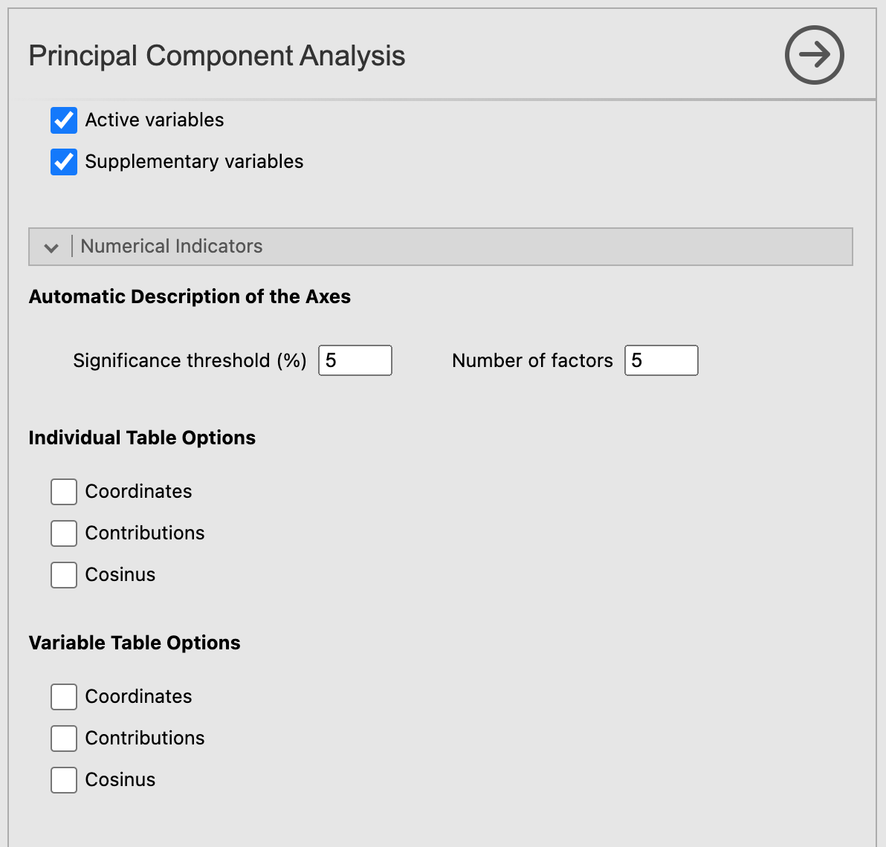
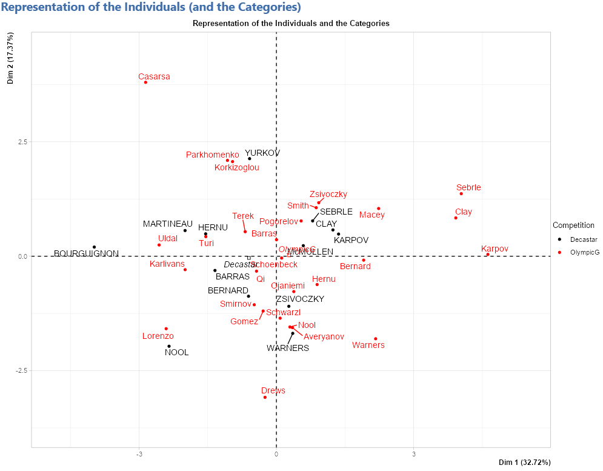
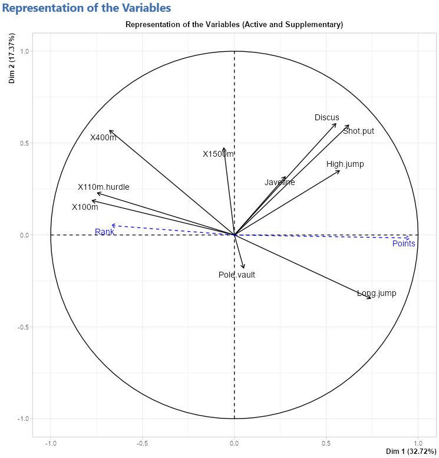
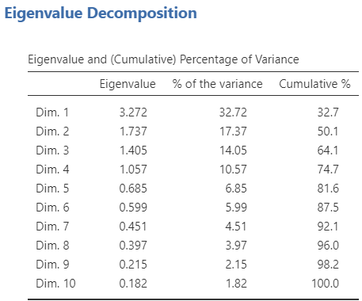
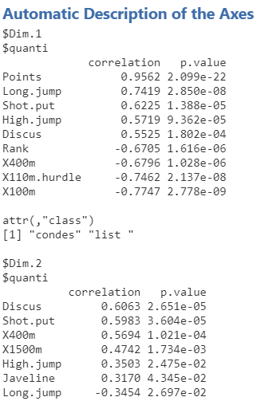
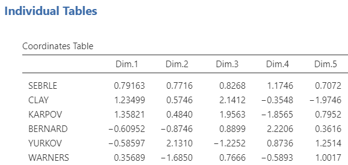

Let's click on the Principal Component Analysis button.\
For the demonstration of the PCA module, we will be using the decathlon data set (you can catch a glimpse of it on the figure below) which comes with MEDA.

```{r PCA1, out.width="80%", fig.align="left", echo=FALSE}
knitr::include_graphics("images/PCA1.png")
```
<br><br />

## **The interface**

When opening the PCA submodule, a rather long graphic user interface (a.k.a. GUI) appears.  It might feels intimidating at first, but we will see how it works step by step.
<br><br />

### Variables selection
```{r PCA2, out.width="50%", fig.align="left", echo=FALSE}
knitr::include_graphics("images/PCA2.png")
```
<br><br />

The first part of this GUI, like most of jamovi modules, is about selecting the variables for your analysis and giving them a role. As you can see on the figure above, there are 4 different types of variable for the PCA. First, we have the active variables, which in the case of a PCA are imperatively quantitative. Then comes the french touch of this module: the quantitative and categorical supplementary variables. These variables won't participate in the construction of the different axes however, they are used to illustrate them. Lastly, the individuals labels variable will label the points on the individuals factor map.
<br><br />

### Normalized PCA
Now, if we scroll down the GUI, we see an option called __*Scale to unit variance*__. This option purpose is to normalize the quantitative variables used in the PCA. Since most of the time PCA are performed on normalized data, this option is checked by default.
<br><br />

### Graphic options
```{r PCA3, out.width="50%", fig.align="left", echo=FALSE}
knitr::include_graphics("images/PCA3.png")
```
<br><br />

Let's move on to the next set of options: the __Graphic options__. As the name suggests, those options rule what will be plotted on the graphics in the results window. With those options, you can choose which components to plot on the x-axis and the y-axis. For the individuals factor map, you can decide to display only the individuals, only the categories (of the categorical variables) or both of them. You can do the same with the active and supplementary variables for the variables factor map. It's also possible to color the individuals based on the value they have for a categorical variable with the option __*Grouping variable*__. This option take as input the position (in the "Categorical Supplementary Variables" field) of the categorical variable used to segregate the individuals with colors. For instance, if we have 4 categorical variables and we want to color the individuals based on the 2nd categorical variable, we would set the __*Grouping variable*__ option to 2.
<br><br />

### Numerical indicators
```{r PCA4, out.width="50%", fig.align="left", echo=FALSE}

```
<br><br />

At last, we have the options for the numerical indicators. The __*Significance threshold*__ option from the __Automatic Description of the Axes__ section fixes the threshold beneath which a variable characterize a dimension. The option __*Number of factors*__ affect both the number of dimensions to be described and the number of dimensions shown for the individual and variable tables (which will be covered right after).\
Finally, the __*individual and variable tables options*__ let you choose to display or not some indicators resulting from the PCA.\
Those indicators (calculated on all the dimensions from 1 to the number in the __*Number of factors*__ option) are:

* The coordinates

* The contributions

* The square cosine
<br><br />

## **Potential issue(s)**

### Incorrect number of factors

For the PCA to run correctly, the number of factors in the **Automatic Description of the Axes** must be less than or equal to the number of active variables selected. If this condition is not met, the analysis will produce an error.
<br><br />

## **Example**

The data set used for this demonstration is the decathlon data set. All the options are checked and the *Grouping variable* option is set to 1 to color the individual based on the competition they participated in. We set the value as 1 because Competition is the first (and only) categorical variable selected.
See the figure below for the settings:
```{r PCA5, out.width="40%", fig.align="left", echo=FALSE}
knitr::include_graphics(c("images/PCA5.png","images/PCA13.png","images/PCA14.png"))
```
<br><br />

### Representation of the individuals
```{r PCA6, out.width="60%", fig.align="left", echo=FALSE}

```
<br><br />

### Representation of the variables
```{r PCA7, out.width="60%", fig.align="left", echo=FALSE}

```
<br><br />

### Eigenvalue table
```{r PCA8, out.width="40%", fig.align="left", echo=FALSE}

```
<br><br />

### Description of the axes
```{r PCA9, out.width="30%", fig.align="left", echo=FALSE}

```
<br><br />

### Individual tables
```{r PCA10, out.width="40%", fig.align="left", echo=FALSE}

```
<br><br />

### Variable tables
```{r PCA11, out.width="40%", fig.align="left", echo=FALSE}
knitr::include_graphics(c("images/PCA11.png","images/PCA12.png"))
```
<br><br />