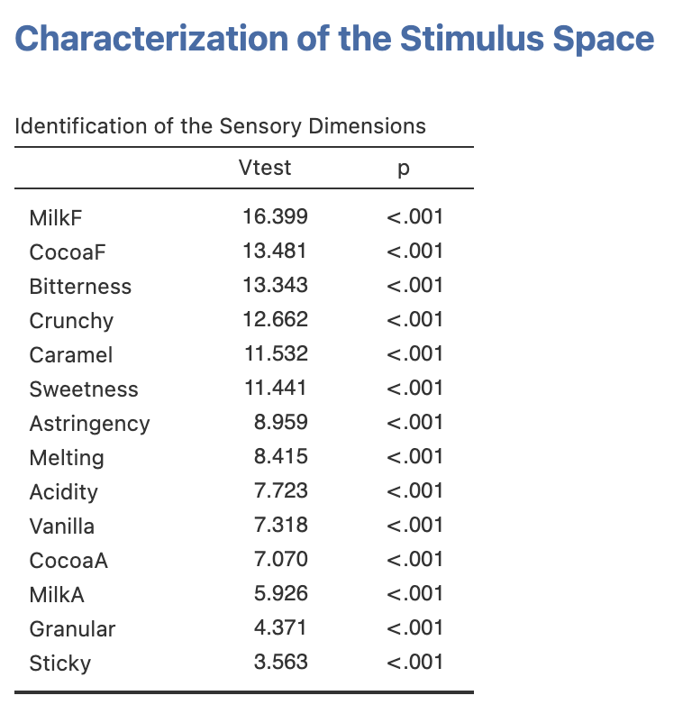

Here, the *decat* function of the *SensoMineR* package has been interfaced. This function provides two types of output: a list of sensory descriptors that characterize the stimuli, and a description of the stimuli based on the sensory descriptors.

## **The interface**
As shown in the figure below, the interface is very simple and only has 4 fields you need to worry about.
<br><br />

```{r charstim2, out.width="65%", fig.align="left", echo=FALSE}
knitr::include_graphics("images/charstim2.png")
```

First, you need to fill in the field associated with the __*Stimulus Effect*__, then the field associated with the __*Subject Effect*__. Each of these effects should be coded as a categorical variable. Finally, you have to fill in the field associated with the  __*Sensory Attributes*__. You can choose as many sensory attributes as you like, the sensory attributes should be coded as continuous variables. By default, the __*Significiance threshold*__ for the statistical tests is set to 5%.
<br><br />

## **Example**
For this example, we will be using the *sensochoc* data set, available with SEDA: 6 chocolates have been evaluated twice by 29 panelists, according to 14 sensory attributes.

```{r charstim5, out.width="90%", fig.align="left", echo=FALSE}

```
<br><br />

We are going to describe the chocolates according to all the sensory attributes. To do so, for each sensory attribute, the *decat* function performs an analysis of variance, explaining the variability among the assessments by the stimulus effect and the panelist effect.

```{r charstim3, out.width="75%", fig.align="left", echo=FALSE}
knitr::include_graphics("images/charstim3.png")
```
<br><br />

The SEDA module provides a list of attributes for which the product effect is significant. This list of attributes is sorted from the most significant to the less (but still) significant (from the highest *Vtest* to the lowest *Vtest*). This list of attributes is obtained from the results of the different analyses of variance and is based on the *omnibus* test (F-test).

```{r charstim4, out.width="50%", fig.align="left", echo=FALSE}

```

Then, the other main output of interest is a sensory description of each stimulus according the attributes.

```{r charstim6, out.width="60%", fig.align="left", echo=FALSE}

```

This output is structured according to five columns: the names of the sensory attributes, the estimate of the coefficient associated with the *Product effect* (the $\alpha_i$ of the model $Y_{ij} = \mu + \alpha_i + \beta_j +\epsilon_{ij}$), the *Adjusted mean* (the estimate of the $\mu + \alpha_i$), the *p-value* associated with the test $H_0: \mu_i=0 \; versus \; H_1: \mu_i \neq 0$ (based on a *Student* test), and the *Vtest* that combines the sign of the estimate of $\mu_i$ and the *p-value*. Practically, *choc1* can be considered as very bitter and not sweet at all.
<br><br />