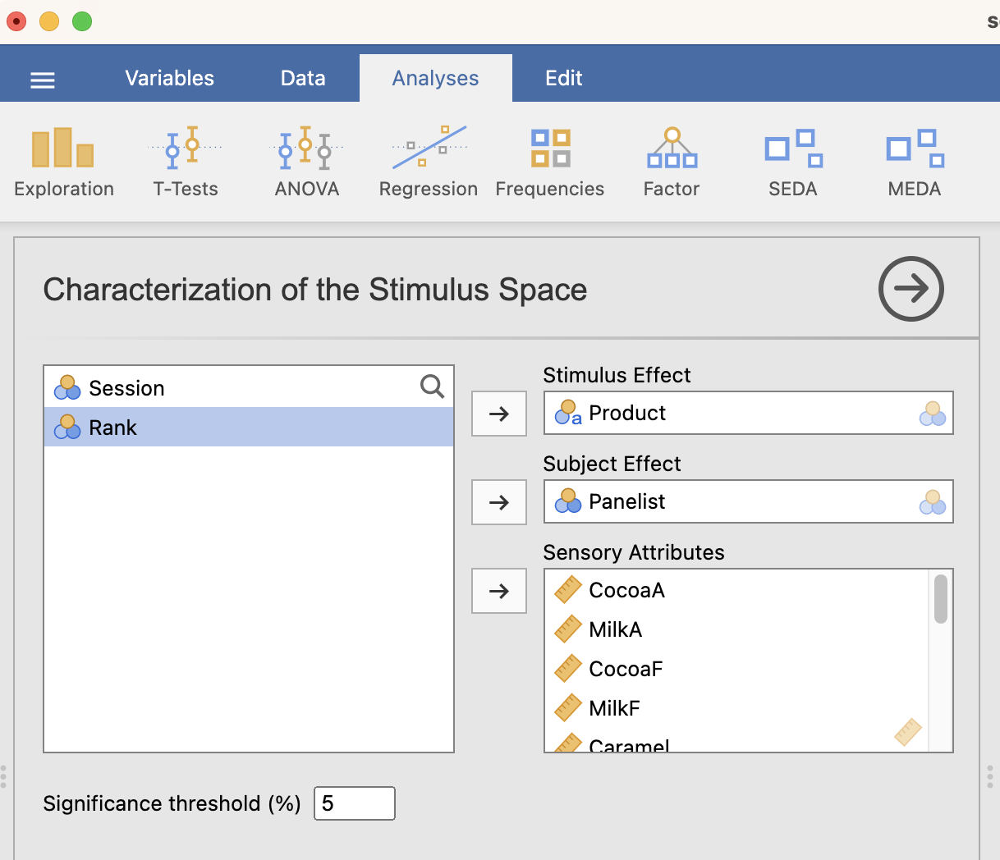

The first method of the **Fixed List of Attributes** submenu is the characterization of the stimulus space according to a fixed list of attributes.

```{r charstim1, out.width="80%", fig.align="left", echo=FALSE}
#knitr::include_graphics("images/charstim1.png")
```
<br><br />

## **The interface**
As it can be seen in the figure above, the interface is very simple and only has 4 fields you need to worry about.
<br><br />
```{r charstim2, out.width="65%", fig.align="left", echo=FALSE}
knitr::include_graphics("images/charstim2.png")
```

Firstly, you put the variable __*Stimulus Effect*__ , a categorical variable that refers to the product that you want to study. Then, you put the __*Subject Effect*__, the main subject that evaluates the product. The __*Sensory Attributes*__ are the fixed attributes of your choice that helps in the description of the stimulus. Lastly, the __*Significiance threshold*__ option set the threshold under which the sensory attributes describes significantly the stimulus.
<br><br />


## **Example**
For this example, we will be using the chocolate data set "sensochoc" (available with SEDA).

```{r charstim5, out.width="90%", fig.align="left", echo=FALSE}
knitr::include_graphics("images/charstim5.png")
```
<br><br />

We are going to describe the Product according to the panelist and using a fixed list variables : Vanilla, Caramel and Bitterness. We let the default value for the Significance threshold:

```{r charstim3, out.width="80%", fig.align="left", echo=FALSE}

```
<br><br />

```{r charstim4, out.width="50%", fig.align="left", echo=FALSE}
knitr::include_graphics("images/charstim4.png")
```

This output highlights the sensory attributes for which products are differentiated at a significance threshold of __*0.05*__. This list of attributes is sorted from the most significant to the less (but still) significant.
We see that products have been extremely differentiated by the panelists: it seems that some attributes, such as __*Bitterness*__ or __*Caramel*__, are really specific to some products (according to the value of the __*"Vtest"*__).
<br><br />

```{r charstim6, out.width="90%", fig.align="left", echo=FALSE}
knitr::include_graphics("images/charstim6.png")
```

Each product is structured according to five components : In the first column, we have the attributes for each sensory profile. The second column shows the estimate coefficient associated with the __*Product effect*__. The third one gives the __*Adjusted mean*__ (mean + coefficient of the Product), the fourth column shows the p-value and the last one the value of the __*Vtest*__.
<br><br />