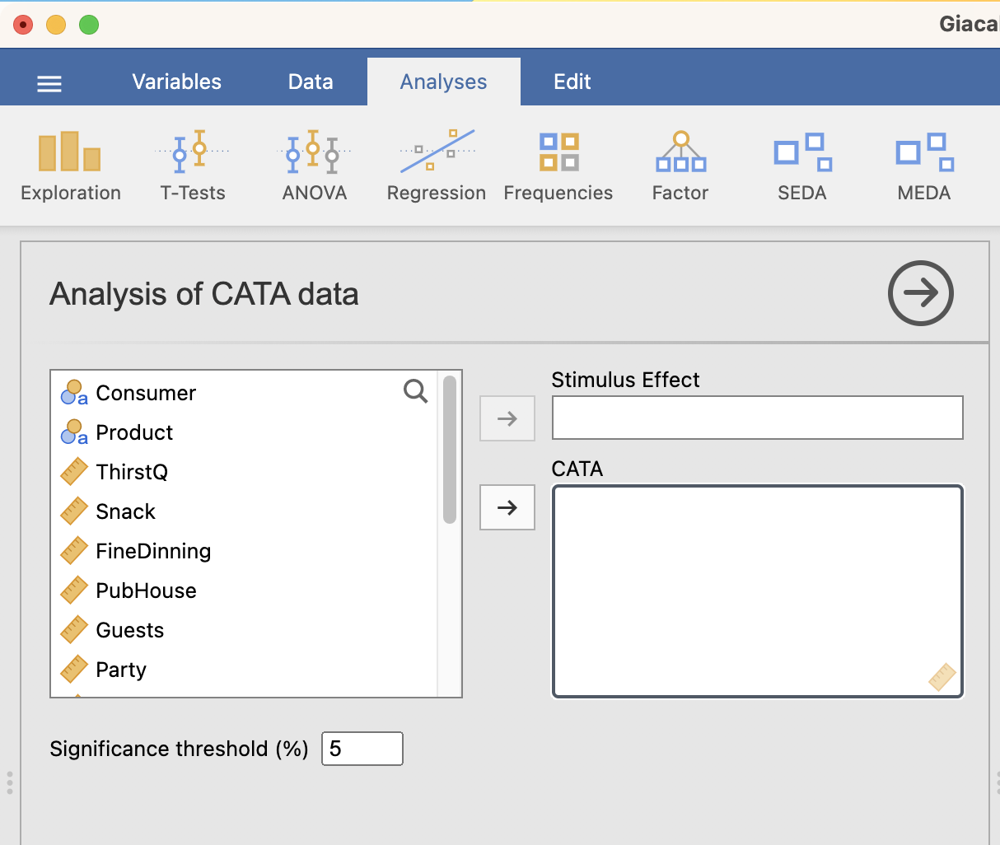
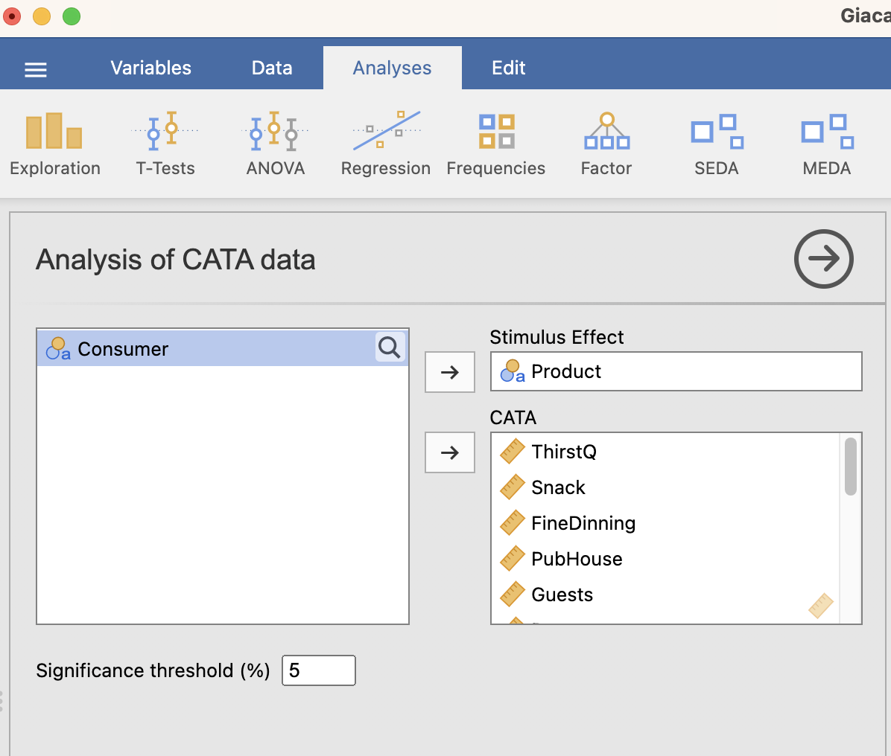
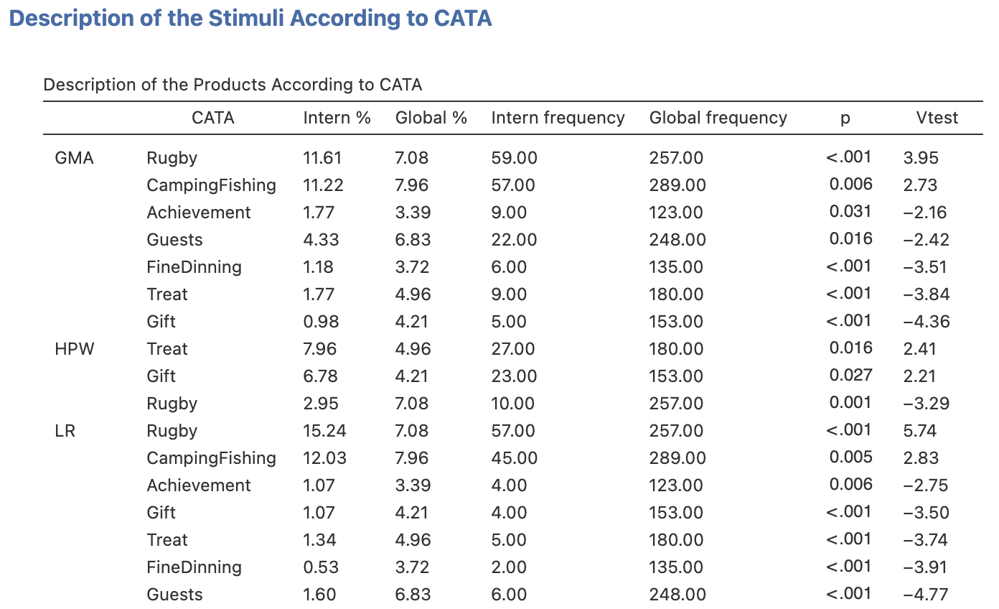
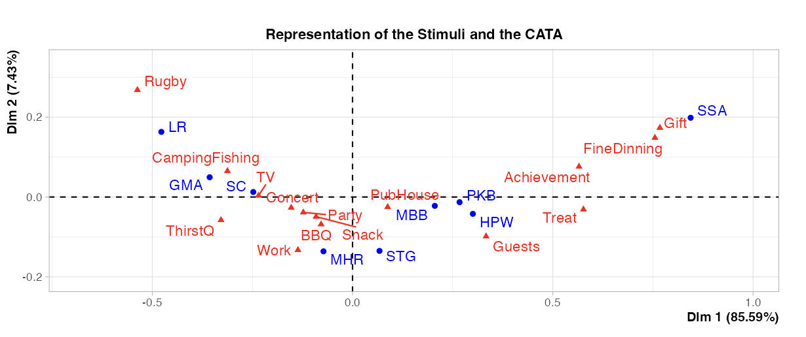

---

Here, we have combined and interfaced three functions of the *FactoMineR* package: the *textual* function, the *descfreq* function and the *CA* function. CATA can be considered as words, and thanks to the *textual* function one can obtain a contingency table crossing the stimuli as rows and the CATA words as columns. From this contingency table, it is quite easy to get a description of each stimulus based on the words that have been checked.

## **The interface**

As shown in the figure above, the interface is very simple and only has 2 fields you need to worry about: the stimulus effect coded as a categorical variable, the CATA words coded as binary or dummy variables.

```{r repstim2, out.width="65%", fig.align="left", echo=FALSE}

```

<br><br />

## **Example**
For this example, we will be using the data from Davide Giacalone's paper: *Situational appropriateness of beer is influenced by product familiarity* (*Food Quality and Preference 39 (2015) 16–27)*. As explained in the paper, "*a questionnaire was designed using beer images and names as stimuli. (...) For each beer image shown, consumers evaluated appropriateness for different contexts and perceived familiarity.*"

```{r idecat2, out.width="65%", fig.align="left", echo=FALSE}

```

The function provides three main results: a contingency table crossing the stimuli as rows and the CATA words as columns (*textual::FactoMineR*), a description of the stimuli (*descfreq::FactoMineR*), a multivariate representation of the stimuli and the CATA words (*CA::FactoMineR*).

The description of the stimuli (below) is based on the hypergeometric distribution. For each product, the function provides a list of CATA words that have been particularly checked, or that haven't been particularly checked. In this example, *GMA* has been associated with the words *Rugby* and *CampingFishing* ; on the contrary, it has not been associated with *Treat* and *Gift*.


```{r idecat3, out.width="75%", fig.align="left", echo=FALSE}

```

Then, we apply the *CA* function on the contigency table to get a multivariate representation of the stimuli.

```{r idecat4, out.width="75%", fig.align="left", echo=FALSE}

```


