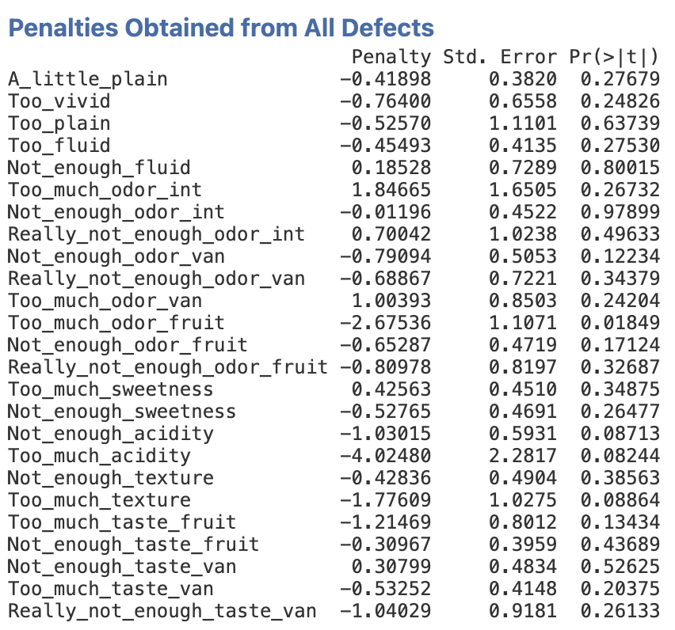
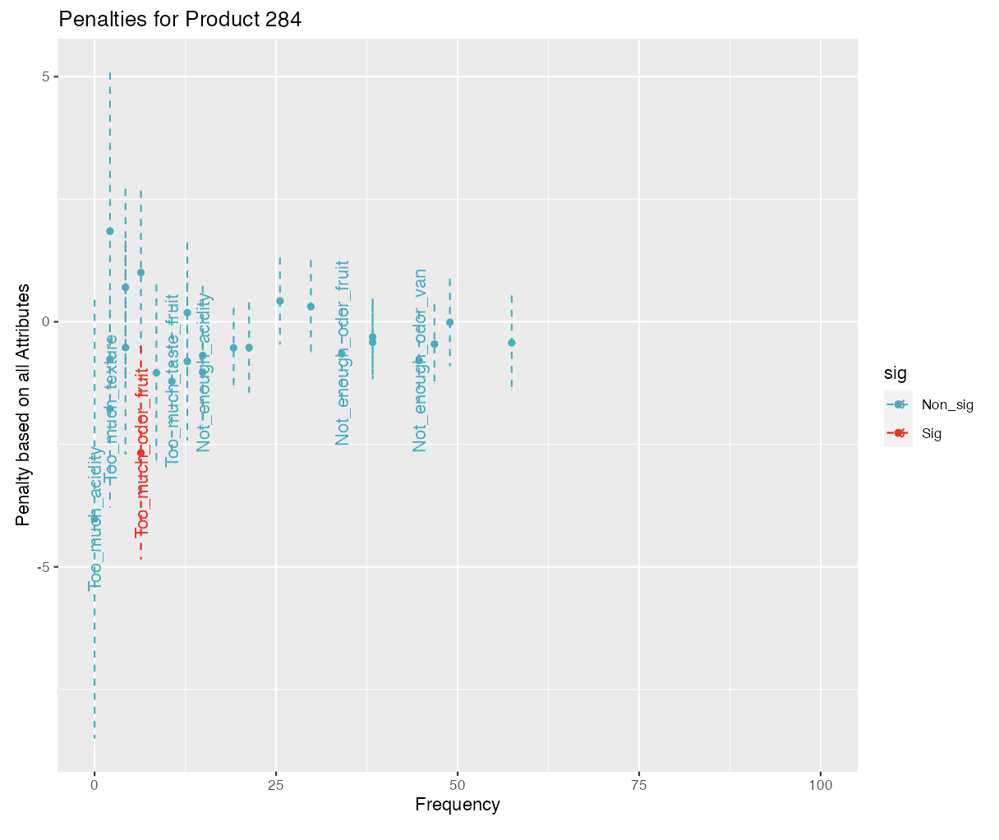

Here, the *JAR* function of the *SensoMineR* package has been interfaced. The methodology is explained in Pagès' paper: *Statistical penalty analysis* (*Food Quality and Preference Volume 32, Part A, March 2014, Pages 16-23*). 

## **The interface**

As shown in the figure below, the interface is very simple and only has 5 fields you need to worry about. The Stimulus effect, the Subject effect, the Liking variable, the Sensory attributes and the way the level *just about right* has been coded in the dataset.

```{r idef1, out.width="65%", fig.align="left", echo=FALSE}
knitr::include_graphics("images/idef1.png")
```
<br><br />

## **Example**

The data used to demonstrate this analysis is the milkshake dataset. In this example, 3 milkshakes have been evaluated by 47 consumers on 10 sensory attributes ; hedonic scores have also been provided.


```{r idef4, out.width="65%", fig.align="left", echo=FALSE}
knitr::include_graphics("images/idef4.png")
```
<br><br />

The function provides two important results: a description of the products in terms of defects, and the defects that are important when assessing the products.

```{r idef6, out.width="75%", fig.align="left", echo=FALSE}
knitr::include_graphics("images/idef6.png")
```
<br><br />

The milkshake 859 has been evaluated as *too fluid*, *not sweet enough*, when on the contrary the milkshake 972 has been evaluated as *too sweet*, with *too much texture*.

This *univariate* description is completed by a multivariate graphical representation, thanks to a correspondence analysis applied on the contingency table crossing the stimuli as rows, the defects as columns.


```{r idef8, out.width="80%", fig.align="left", echo=FALSE}
knitr::include_graphics("images/idef8.png")
```
<br><br />

Finally, the function provides a list of the defects with their respective impact on the hedonic scores. 

```{r idef9, out.width="60%", fig.align="left", echo=FALSE}

```
<br><br />

To conclude, the functions provides a graphical representation that summarizes these information for the product associated with the first level of the product effect.

```{r idef10, out.width="90%", fig.align="left", echo=FALSE}

```
<br><br />

The order of the levels of the product effect can be changed easily. To do so, go back to data, click on the product variable and change the order of the levels by clicking on the arrows.


```{r idef11, out.width="80%", fig.align="left", echo=FALSE}

```
<br><br />

Here, you can see that product 284 is considered as the *first* product.

