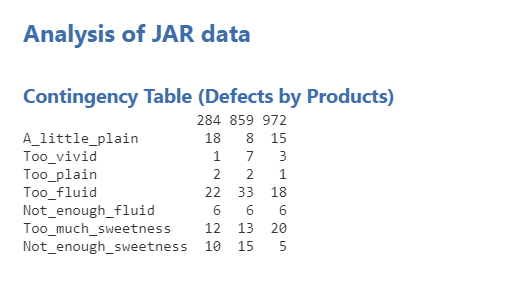
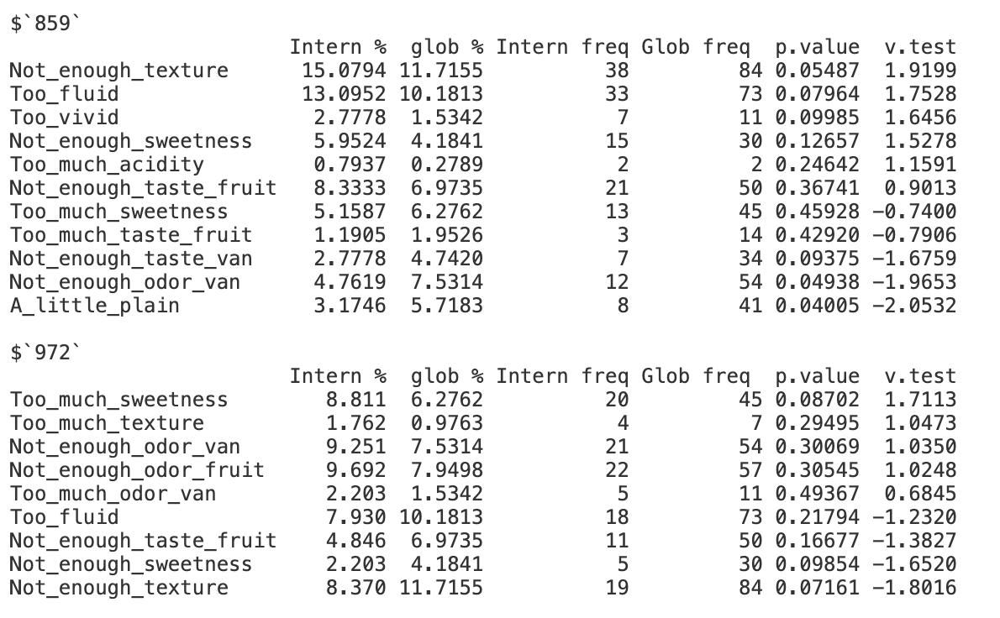
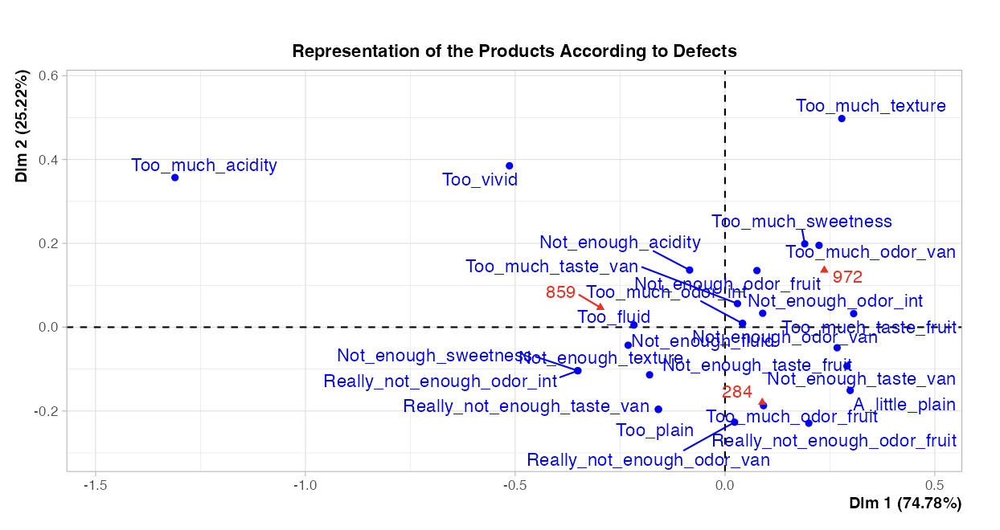

The last method of the **Fixed List of Attributes** submenu is used to identificate the defects.

```{r idef1, out.width="80%", fig.align="left", echo=FALSE}
#knitr::include_graphics("images/idef1.png")
```
<br><br />

## **The interface**

```{r idef2, out.width="80%", fig.align="left", echo=FALSE}

```
<br><br />

## **Potential issue(s)**


## **Example**

The data used to demonstrate this analysis is the milkshake dataset.

```{r idef3, out.width="90%", fig.align="left", echo=FALSE}

```
<br><br />

```{r idef4, out.width="80%", fig.align="left", echo=FALSE}
knitr::include_graphics("images/idef4.png")
```
<br><br />

```{r idef5, out.width="90%", fig.align="left", echo=FALSE}

```
<br><br />

```{r idef6, out.width="90%", fig.align="left", echo=FALSE}

```
<br><br />

```{r idef7, out.width="90%", fig.align="left", echo=FALSE}
knitr::include_graphics("images/idef7.png")
```
<br><br />

```{r idef8, out.width="70%", fig.align="left", echo=FALSE}

```
<br><br />

```{r idef9, out.width="90%", fig.align="left", echo=FALSE}
knitr::include_graphics("images/idef9.png")
```
<br><br />

```{r idef10, out.width="90%", fig.align="left", echo=FALSE}
knitr::include_graphics("images/idef10.png")
```
<br><br />
