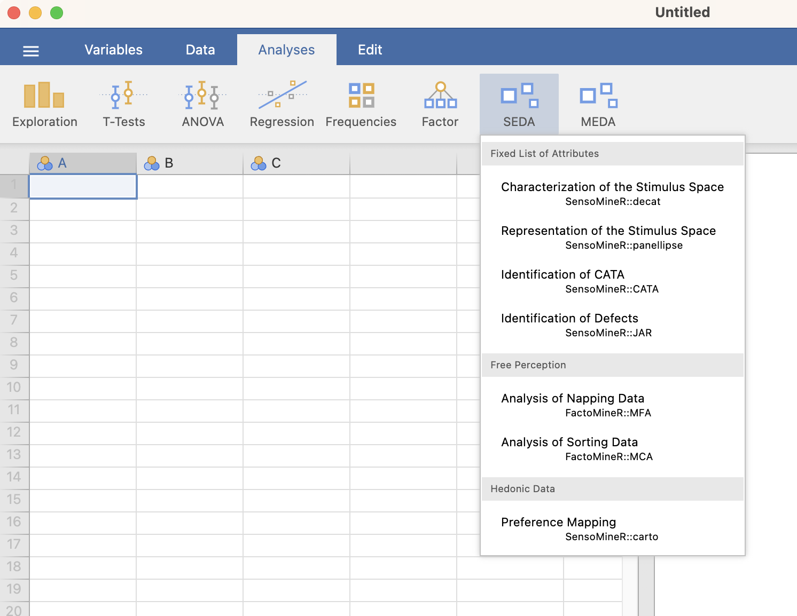

SEDA is jamovi module for analyzing sensory data. Three main types of data can be analyzed: data obtained when stimuli are described according to a fixed list of attributes (QDA data, for instance), data obtained when stimuli are described  "freely" (sorting data, for instance), and finally, hedonic data (external preference mapping).

```{r MenuMEDA, out.width="80%", fig.align="left", echo=FALSE}

```
<br><br />

The following is a list of the methods that are implemented in the SEDA module.

When stimuli are described according to a **fixed list of attributes**:

* [Characterization of the Stimulus Space](charstim.html)
* [Representation of the Stimulus Space](repstim.html)
* [Identification of CATA](idecat.html)
* [Identification of the Defects](idef.html)


When stimuli are described  **freely**:

* [Analysis of Napping Data](AND.html)
* [Analysis of Sorting Data](ASD.html)

When dealing with **dedonic data**:

* [Preference Mapping](prefmap.html)

