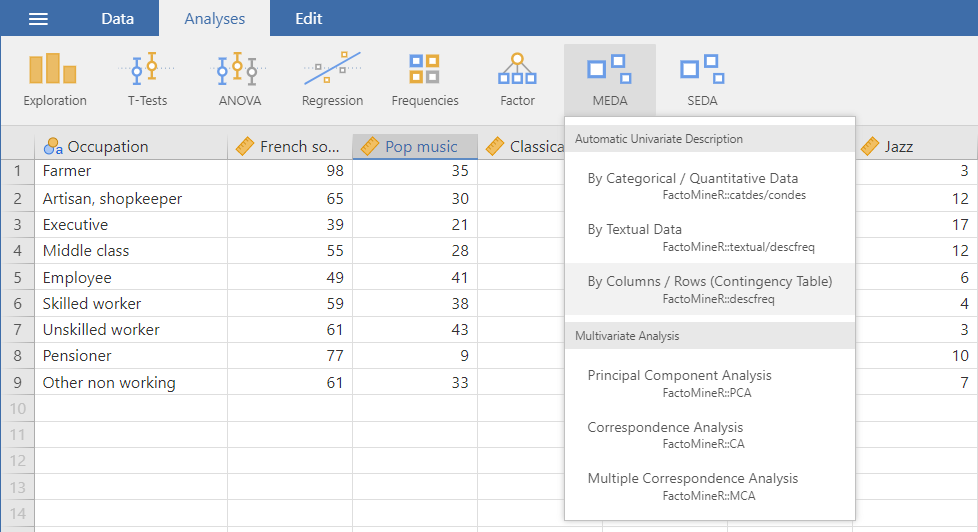
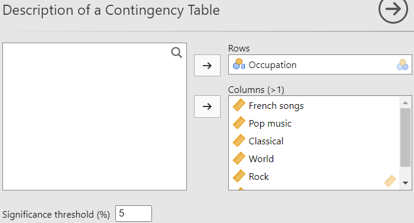

The second method of the **Fixed List of Attributes** submenu is the representation of the stimulus space according to a fixed list of attributes.

```{r descfreq1, out.width="80%", fig.align="left", echo=FALSE}
#
```
<br><br />

## **The interface**


```{r descfreq2, out.width="60%", fig.align="left", echo=FALSE}
#
```
<br><br />

## **Potential issue(s)**
For the analysis to run smoothly, make sure that...
<br><br />

## **Example**
For this example, we will be using gain the chocolate data set (available with SEDA).
```{r descfreq3, out.width="60%", fig.align="left", echo=FALSE}
#knitr::include_graphics(c("images/descfreq3.png","images/descfreq4.png"))
```
<br><br />