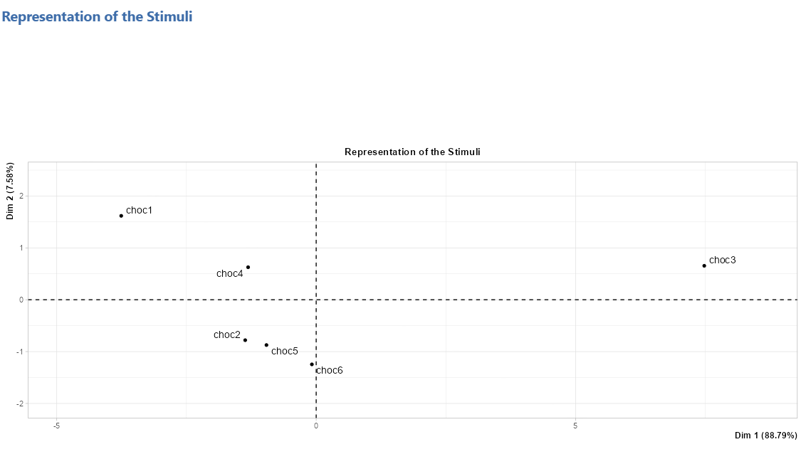
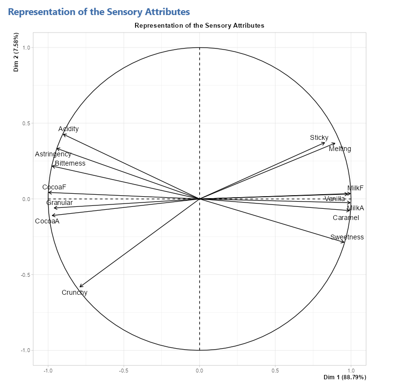
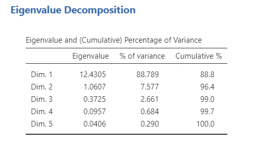

The second method of the **Fixed List of Attributes** submenu is the representation of the stimulus space according to a fixed list of attributes.

```{r repstim1, out.width="80%", fig.align="left", echo=FALSE}
#knitr::include_graphics("images/repstim1.png")
```
<br><br />

## **The interface**


```{r repstim2, out.width="80%", fig.align="left", echo=FALSE}
knitr::include_graphics("images/repstim2.png")
```
<br><br />

```{r repstim3, out.width="80%", fig.align="left", echo=FALSE}
knitr::include_graphics("images/repstim3.png")
```
<br><br />

```{r repstim4, out.width="80%", fig.align="left", echo=FALSE}
knitr::include_graphics("images/repstim4.png")
```
<br><br />

```{r repstim5, out.width="80%", fig.align="left", echo=FALSE}
knitr::include_graphics("images/repstim5.png")
```
<br><br />

```{r repstim6, out.width="80%", fig.align="left", echo=FALSE}
knitr::include_graphics("images/repstim6.png")
```
<br><br />

## **Potential issue(s)**
For the analysis to run smoothly, make sure that...
<br><br />

## **Example**
For this example, we will be using gain the chocolate data set (available with SEDA).

```{r repstim7, out.width="90%", fig.align="left", echo=FALSE}
knitr::include_graphics("images/charstim5.png")
```
<br><br />

```{r repstim8, out.width="95%", fig.align="left", echo=FALSE}
knitr::include_graphics("images/repstim7.png")
```
<br><br />

```{r repstim9, out.width="80%", fig.align="left", echo=FALSE}

```
<br><br />

```{r repstim10, out.width="70%", fig.align="left", echo=FALSE}

```
<br><br />

```{r repstim11, out.width="50%", fig.align="left", echo=FALSE}

```
<br><br />

```{r repstim12, out.width="95%", fig.align="left", echo=FALSE}
knitr::include_graphics("images/repstim11.png")
```
<br><br />

```{r repstim13, out.width="95%", fig.align="left", echo=FALSE}
knitr::include_graphics("images/repstim12.png")
```
<br><br />
