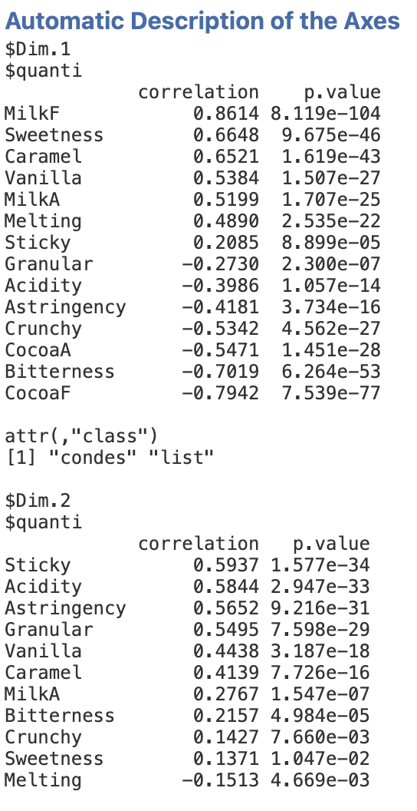
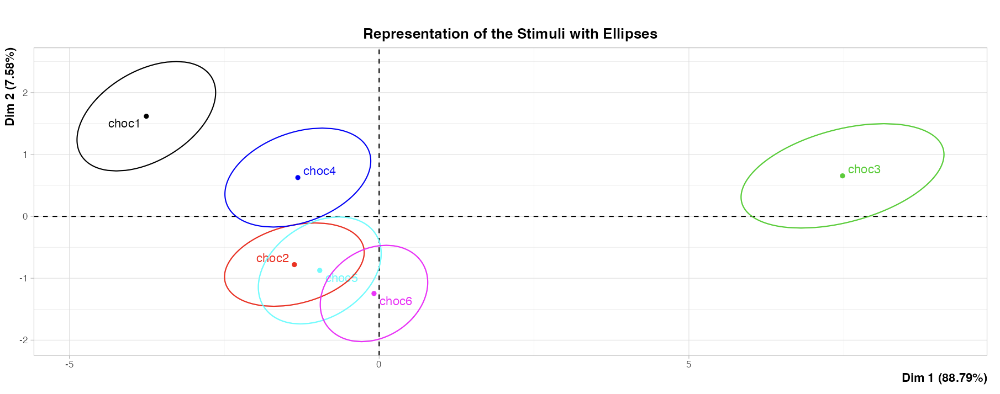

The second method of the **Fixed List of Attributes** submenu is the representation of the stimulus space according to a fixed list of attributes.

```{r repstim1, out.width="65%", fig.align="left", echo=FALSE}
#knitr::include_graphics("images/repstim1.png")
```
<br><br />

## **The interface**

This interface has a richer structure than the first submenu.It might feels intimidating at first, but we will see how it works step by step.

### Variable selection
```{r repstim2, out.width="65%", fig.align="left", echo=FALSE}
knitr::include_graphics("images/repstim2.png")
```
The first part is about selecting the variables for your analysis and giving them a role. As you can see on the figure above, there are 3 different types of variable for the representation (same as the first page of the submenu). The description of the attributes is available on the page __*Characterization of the stimulus space according to a fixed list of attributes*__.
<br><br />

### Options on the Sensory Attributes

```{r repstim3, out.width="65%", fig.align="left", echo=FALSE}

```

There are two filters concerning the __*Sensory Attributes*__ :
- An option called __*Scale to unit variance*__. This option purpose is to normalize the Sensory Attributes used in the representation. Since most of the time the representation of stimuli are performed on normalized data, this option is checked by default.
- An option __*Selection of the Sensory Attributes*__ that aims in choosing the __*p-value*__ of the Stimulus Effect.

### Graphic options
```{r repstim4, out.width="65%", fig.align="left", echo=FALSE}

```

Let’s move on to the next set of options: the Graphic options. As the name suggests, those options rule what will be plotted on the graphics in the results window. With those options, you can choose which components to plot on the x-axis and the y-axis. 
For the additionnal plots, you have two possibilities: you can decide to add a plot that represents stimuli according to the panels of each product (separated with different colors), which shows the variability of stimuli, or you can choose an additionnal plot that does the same but with sensory attributes.
<br><br />

### Resampling Options

```{r repstim5, out.width="65%", fig.align="left", echo=FALSE}

```

With the __*Resampling Options*__, you can choose the number of subjects and panels of your choice. Same method for the __*Significiance threshold*__ option. You can also center or scale by subject.
<br><br />

### Numerical Indicators

```{r repstim6, out.width="65%", fig.align="left", echo=FALSE}
knitr::include_graphics("images/repstim6.png")
```
<br><br />


## **Example**
For this example, we will be using again the chocolate data set "sensochoc" (available with SEDA).

```{r repstim7, out.width="90%", fig.align="left", echo=FALSE}
knitr::include_graphics("images/charstim5.png")
```
<br><br />

```{r repstim8, out.width="65%", fig.align="left", echo=FALSE}

```
<br><br />

```{r repstim9, out.width="95%", fig.align="left", echo=FALSE}
knitr::include_graphics("images/repstim8.png")
```
<br><br />

```{r repstim10, out.width="70%", fig.align="left", echo=FALSE}
knitr::include_graphics("images/repstim9.png")
```
<br><br />

```{r repstim11, out.width="60%", fig.align="left", echo=FALSE}
knitr::include_graphics("images/repstim10.png")
```
<br><br />

```{r repstim12, out.width="40%", fig.align="left", echo=FALSE}

```
<br><br />

```{r repstim13, out.width="95%", fig.align="left", echo=FALSE}

```
<br><br />

```{r repstim14, out.width="80%", fig.align="left", echo=FALSE}

```
<br><br />
