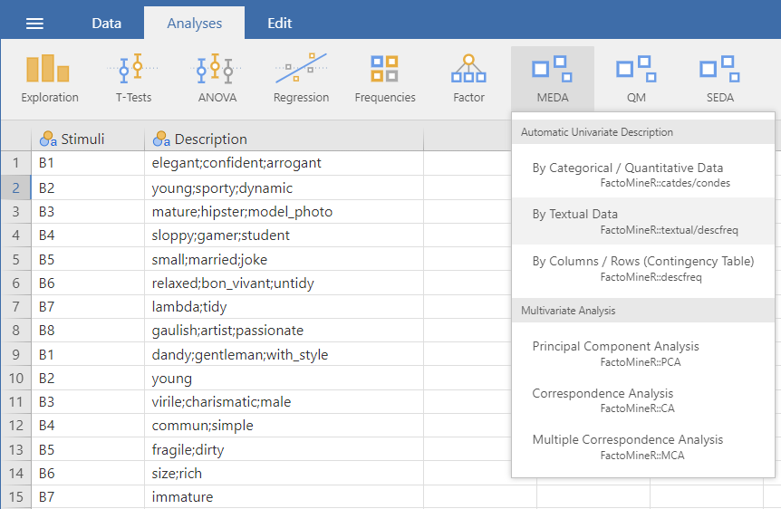
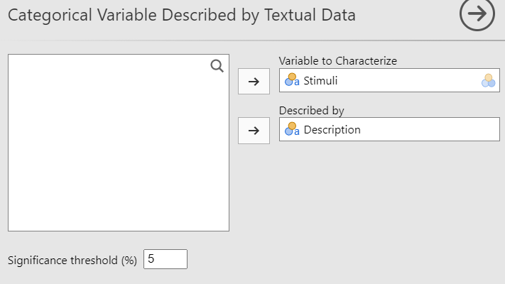

The second method of the **Automatic Univariate Description** submenu is used to describe categorical variable with textual data.

```{r textual1, out.width="80%", fig.align="left", echo=FALSE}

```
<br><br />

## **The interface**
Like the other two methods of the **Automatic Univariate Description** submenu, the GUI is very minimalist and only let you select the variable to describe, the textual variable used for the description and the significance threshold.
```{r textual2, out.width="60%", fig.align="left", echo=FALSE}

```
<br><br />

## **Potential issue(s)**

Unlike the first **Automatic Univariate Description** method, you shouldn't try to set a significance threshold too high. Otherwise, the analysis will run for a very long time (since there might be hundreds of different words) and might not even finish.

## **Example**

The data used to demonstrate this analysis is the beard_description data set (which you can see on the first figure). For this example, we will use the default settings (see the previous figure).
<br><br />

```{r textual3, out.width="60%", fig.align="left", echo=FALSE}
knitr::include_graphics(c("images/textual3.png","images/textual4.png"))
```
